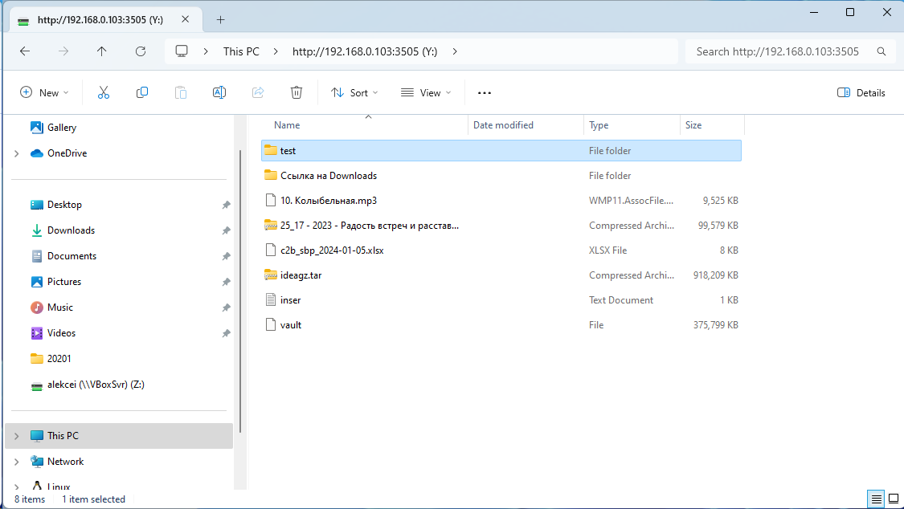
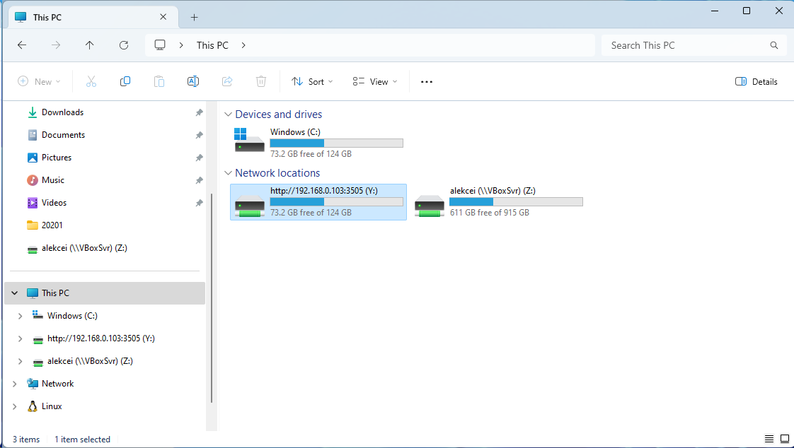
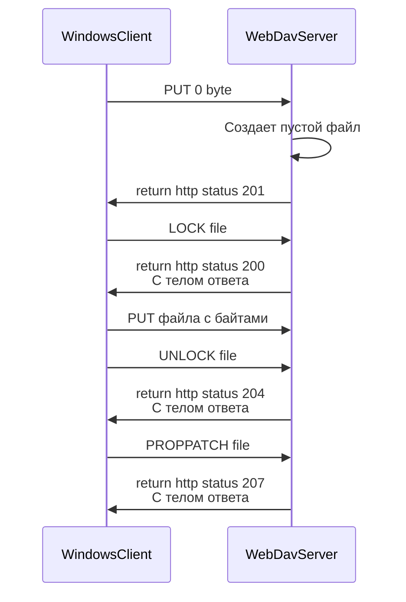

### Создание самоподписанного сертификата

### Настройка само подписанного сертификата
1 Создаем ключевую пару
2 пакуем ее в контейнер p12
3 добавляем контейнер в доверенные сертификаты хрома
4 добавляем контейнер в доверенные сертификат в FF
Preferences -> Privacy & Security -> View Certificates · choose Servers Tab ...

### WindowsClient клиент
Ддя подключения из WebClient MsWebDav необходимо добавить разрешения в реестре.  

HKLM\SYSTEM\CurrentControlSet\Services\WebClient\Parameters

BasicAuthLevel – тип аутентификации, используемый клиентом WebClient. Доступны следующие значения:

**0** — Базовая (Basic) аутентификация отключена  
**1** — Базовая (аутентификация включена только SSL каталогов — это значение используется по умолчанию в Windows Server 2016)  
**2** и выше — используется базовая аутентификация для любого типа общих каталогов, как с поддержкой SSL,  
  так и без (это небезопасный вариант, т.к. имя и пароль пользователя при таком типе аутентификации пересылаются по сети в открытом виде)  
При включении данной настройки можно тестировать webDav под http.

### WindowsClient описание последовательности запросов.
Стандартный клиент windows, через который идет подключение сетевого диска имеет некую специфику при взаимодействии с сервером.  
 

**Добавление файла на сервер**

Ссылки:  
1 https://www.baeldung.com/linux/add-self-signed-certificate-trusted-list   
2 https://documentation.solarwinds.com/en/success_center/whd/content/helpdeskcreatepkcs12ikeystorefromprivatekeycert.htm   
3 https://www.baeldung.com/linux/add-self-signed-certificate-trusted-list  
4 https://unix.stackexchange.com/questions/644176/how-to-permanently-add-self-signed-certificate-in-firefox  
4 https://aboutssl.org/how-to-fix-mozilla-pkix-self-signed-cert-error/  